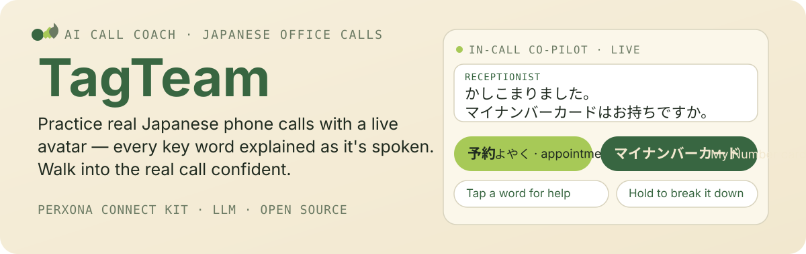
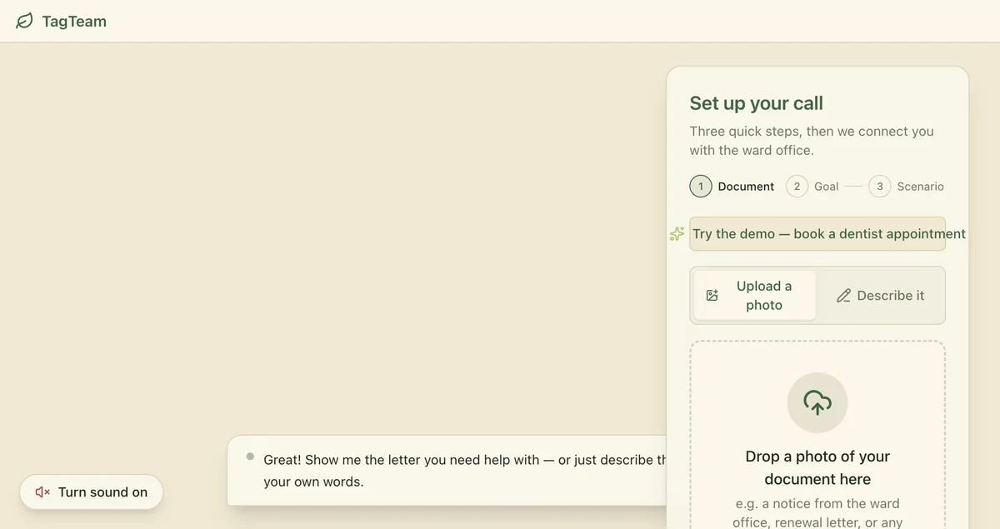
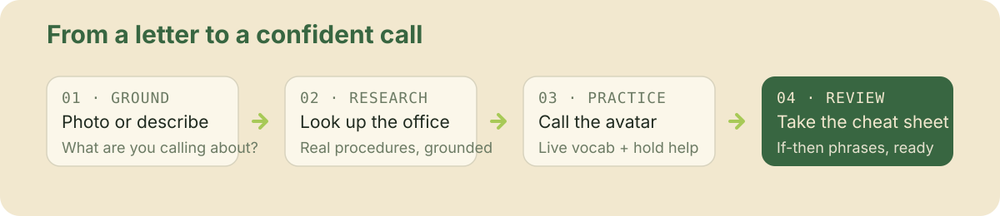

<p align="center">
  
</p>

# TagTeam

**Your personal Japanese call coach.** Practice real bureaucracy phone calls with a live 3D avatar before you ever dial — upload the letter you received (or just describe the problem), and TagTeam builds the call around it.

## Why it exists

Living in Japan means phone calls — to the ward office, the dentist, the tax office — in rapid, formal Japanese you never practiced and can't pause. For non-native residents, a wrong word costs a re-do and silence costs confidence.

TagTeam turns that wall into a safe practice room.

## See it in action

<p align="center">
  
</p>

Try the demo with one click: **Get started → "Try the demo — book a dentist appointment" → Start call.** The receptionist checks whether you're a first-time patient and whether you have your **My Number card** — with every word explained live.

## What it does

1. **Ground** — upload a photo of your notice or letter, or just describe the issue. TagTeam asks 1–2 quick English questions to pin down your call's objective.
2. **Research (optional)** — look up the office you're calling (real web results via SearXNG + Firecrawl) so the practice mirrors reality, not a generic script.
3. **Practice** — a receptionist avatar runs a natural, authentic-speed Japanese call. You answer; the avatar responds like the real office.
4. **Review** — a scan-friendly cheat sheet captures your goal, the exact if-then phrases, and what to practice.

<p align="center">
  
</p>

## What makes it different

- **A real co-pilot, not a script reader.** Live vocabulary cards (kanji, furigana, English) appear at 5x size the moment the word is spoken.
- **Pause on your terms.** Tap a word for a quick hint; hold to pause the call at the next turn and have the avatar break it down — then resume.
- **One consistent character.** Meeks guides setup, becomes your receptionist in the call, then walks you through your cheat sheet.
- **Built on real avatar tech.** The Perxona Connect Kit `<sv-presenter>` web component — tokens minted via a thin backend proxy, with real avatar/scene/voice/motion catalogs.

## Getting started

```bash
pnpm install
cp .env.example .env   # fill PERXONA_CONNECT_EMAIL/PASSWORD + LLM_API_KEY
pnpm dev               # api :8083 + web :5173
```

Open http://localhost:5173. Verify: `pnpm build && pnpm lint && pnpm test`. Production: `pnpm build && pnpm start`.

**Full walkthrough — accounts, your own search/scraping (SearXNG + Firecrawl), and troubleshooting: see [`SETUP.md`](SETUP.md).**

## Notes

- The Connect identity lives server-side (env-held credentials); there is no user login.
- The LLM runs through a server-side proxy (`/api/llm`); the API key never reaches the browser.
- Built with React 19 + Vite + TypeScript + Tailwind CSS and an OpenAI-compatible LLM (foundry `gemma4-mtp`).

## Repo map

- `server.mjs` — Express proxy: mints connect tokens, proxies the avatar/scene/voice catalog, serves the built app.
- `src/shared/contract.ts` — cross-module data contract (SimScript, Glossary, CheatSheet, player API).
- `src/lib/` — api/presenter (Connect), llm/doc-parser/sim-engine/glossary/cheat-sheet (AI pipeline).
- `src/hooks/` — React bindings; `use-script-player` is the sentence-queue driving the call.
- `src/components/` — `setup/`, `call/`, `cheat-sheet/`, `stage/` UI.
